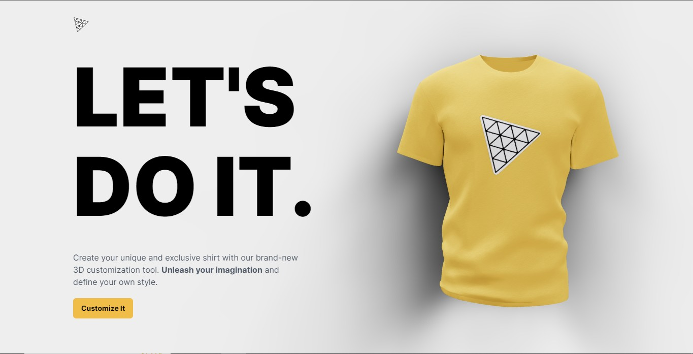

  
# T-Shirt 3D Customizer With ChatGPT 👕 

T-Shirt 3D Customizer With ChatGPT is a fun and interactive project that allows users to make their own customized t-shirt by selecting their preferred color and design. Additionally, users can even ask ChatGPT to make their custom t-shirt using natural language prompts.

## Installation 🛠️

1. Clone this repository to your local machine.
2. Install the required dependencies by running `npm install`.

## Dependencies 📦

### Server

| Badge | Name | Version |
| --- | --- | --- |
|  | express | ^4.18.2 |
|  | mongoose | ^7.0.3 |
|  | openai | ^3.2.1 |

### Client

| Badge | Name | Version |
| --- | --- | --- |
|  | React | ^18.2.0 |
|  | Three.js | ^0.151.2 |
|  | Framer-Motion | ^10.10.0 |
|  | React-Color | ^2.19.3 |

### Dev Dependencies

| Badge | Name | Version |
| --- | --- | --- |
|  | Vite | ^4.2.0 |
|  | TailwindCSS | ^3.3.1 |
|  | Autoprefixer | ^10.4.14 |

## Usage 💡

To use this project, follow these steps:

1. Start the server using `npm start`.
2. Open the project in your web browser through `localhost:3000`.
3. Customize your t-shirt using the options on the screen.
4. Ask ChatGPT to make your t-shirt by using natural language prompts.
5. Submit your order and wait for it to be delivered!

## Contributing 🤝

Contributions are always welcome! Please fork this repository and submit a pull request.

## Thank You 🙏

Thank you for checking out this project! If you find it helpful or interesting, your support would be greatly appreciated.

- ⭐️ Star the project on [GitHub](https://github.com/ElonMusk2002/T-Shirt_3D_Customizer_With_ChatGPT)
- 🐛 Open an [issue](https://github.com/ElonMusk2002/T-Shirt_3D_Customizer_With_ChatGPT/issues) if you found a bug
- 🛠️ Submit a [pull request](https://github.com/ElonMusk2002/T-Shirt_3D_Customizer_With_ChatGPT/pulls) to contribute

Feel free to reach out if you have any questions or suggestions!

